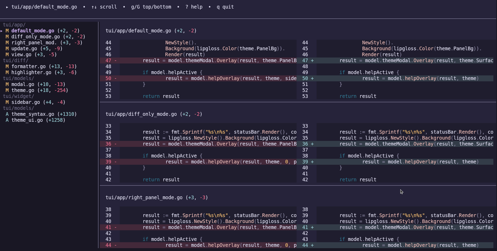
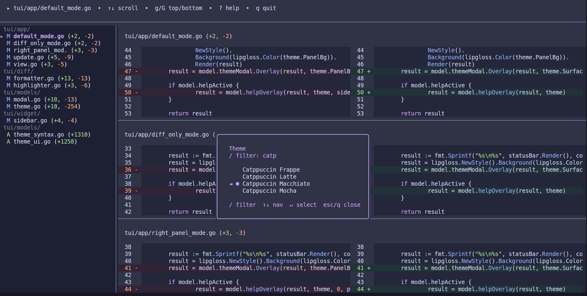

# kanba




A fast, keyboard-driven terminal UI for browsing `git diff` and `git show` output — with syntax highlighting, mouse-driven text selection, and a live theme switcher.

kanba wraps your existing git plumbing (it shells out to `git diff` / `git show`) and renders the result in a responsive TUI instead of a raw terminal dump: side-by-side old/new panels, a file sidebar, per-file stats, and Chroma-powered syntax highlighting for dozens of languages.

## Features

- **Side-by-side or unified diff view**, chosen automatically based on your terminal width
- **File sidebar** grouped by directory, with added/deleted/modified indicators and per-file `+N/-N` stats
- **Syntax highlighting** via [Chroma](https://github.com/alecthomas/chroma), lexer auto-detected per file
- **Mouse support**: click a file to jump to it, click-drag to select text (word-wise on double-click), copy-on-release to clipboard
- **Live theme switcher** — 3 handcrafted Rosé Pine themes plus every Chroma style (`monokai`, `dracula`, `nord`, `github`, and dozens more), fuzzy-filterable
- **Untracked files** included in the working-tree diff view
- **Passes flags straight through to git** — `kanba diff --staged`, `kanba diff HEAD~3`, `kanba show <ref>` all work as you'd expect

## Installation

### Quick install (Linux, macOS)

```bash
curl -fsSL https://raw.githubusercontent.com/hxsggsz/kanba/main/install.sh | bash
```

This detects your OS/arch, downloads the latest release binary from GitHub, verifies its checksum, and installs it to `~/.local/bin/kanba`. Make sure `~/.local/bin` is on your `$PATH` (the installer will warn you if it isn't).

To install a specific version instead of the latest:

```bash
KANBA_VERSION=v1.2.0 curl -fsSL https://raw.githubusercontent.com/hxsggsz/kanba/main/install.sh | bash
```

To install somewhere other than `~/.local/bin`:

```bash
KANBA_INSTALL_DIR=/usr/local/bin curl -fsSL https://raw.githubusercontent.com/hxsggsz/kanba/main/install.sh | bash
```

Supported platforms: Linux and macOS, amd64 and arm64. Windows is not supported.

### Build from source

Requires Go 1.25+.

```bash
git clone https://github.com/hxsggsz/kanba.git
cd kanba
make build   # produces ./kanba
```

Or run without building a binary:

```bash
make dev     # go run .
```

### Check your version

```bash
kanba version
# or
kanba --version
```

## Usage

Run `kanba` inside any git repository.

| Command | What it does |
|---|---|
| `kanba` | Show the working-tree diff (equivalent to `git diff`) |
| `kanba diff [flags]` | Show a diff; flags are passed straight through to `git diff` (e.g. `kanba diff --staged`, `kanba diff HEAD~3`) |
| `kanba show [ref]` | Show a specific commit or reference (`git show <ref>`) |
| `kanba version` / `kanba --version` | Print the installed version |

### Keybindings

**Navigation** (works in every layout):

| Key | Action |
|---|---|
| `↑` / `k` | Scroll up |
| `↓` / `j` | Scroll down |
| `g` | Jump to top |
| `G` | Jump to bottom |
| `h` / `←` | Scroll left |
| `l` / `→` | Scroll right |
| `ctrl+←` / `ctrl+→` | Scroll left/right, fast |
| `_` | Jump to line start |
| `$` | Jump to line end |

**Actions:**

| Key | Action |
|---|---|
| `y` | Copy the current file's path to the clipboard |
| `t` | Open the theme switcher |
| `?` | Toggle the keybindings help overlay |
| `esc` | Close the help overlay or theme switcher |
| `q` / `ctrl+c` | Quit |

**Theme switcher** (after pressing `t`):

| Key | Action |
|---|---|
| `/` | Focus the filter input to search themes by name |
| `↑`/`k`, `↓`/`j` | Move selection |
| `tab` | Cycle to the next filtered match |
| `enter` | Apply the selected theme |
| `esc` | Clear the filter, then close on a second press |
| `t` / `q` | Close the theme switcher |

**Mouse:**

- Click a file in the sidebar to jump to it
- Click a file's header inside a diff panel to copy its path
- Click-drag over diff text to select it; double-click to select a word
- Release the mouse over a selection to copy it to the clipboard
- Scroll wheel to scroll; hold `Alt` while scrolling to move faster
- Click empty diff space to jump the scroll position proportionally, like a scrollbar

### Layout modes

kanba adapts its layout to your terminal width automatically:

| Width | Layout |
|---|---|
| ≥ 160 cols | Sidebar + side-by-side (old \| new) diff panels |
| 100–159 cols | Side-by-side diff panels, no sidebar |
| < 100 cols | Single unified diff panel (classic `+`/`-` style), no sidebar |

### Configuration

kanba reads an optional YAML config file from:

```
$XDG_CONFIG_HOME/kanba/config.yaml
```

(falls back to `~/.config/kanba/config.yaml` if `$XDG_CONFIG_HOME` is unset; `config.yml` also works). If the file doesn't exist, kanba just uses its defaults — no setup required.

Currently supported options:

```yaml
theme: rose-pine-moon
```

`theme` accepts any of the built-in Rosé Pine themes (`rose-pine`, `rose-pine-moon`, `rose-pine-dawn`) or any [Chroma style name](https://github.com/alecthomas/chroma/tree/master/styles) (e.g. `monokai`, `dracula`, `nord`, `github`). An unrecognized theme name falls back to a default. You can also switch themes live at any time by pressing `t` inside the TUI — that change is session-only and isn't written back to the config file.

### Debugging

Set the `DEBUG` environment variable to enable logging to `debug.log` in the current directory:

```bash
DEBUG=1 kanba
```

## Releasing (maintainers)

Cutting a release is fully automated once a tag is pushed:

```bash
make tag NEW_TAG=1.2.0
```

This creates and pushes an annotated tag `v1.2.0` from `main`. A GitHub Actions workflow then builds binaries for linux/darwin × amd64/arm64, generates checksums, and publishes them as a GitHub Release — ready to be picked up by `install.sh`.

## Built with

- [Bubble Tea v2](https://github.com/charmbracelet/bubbletea) — TUI framework
- [Lip Gloss v2](https://github.com/charmbracelet/lipgloss) — styling and layout
- [Chroma v2](https://github.com/alecthomas/chroma) — syntax highlighting
- [Cobra](https://github.com/spf13/cobra) — CLI commands
- [atotto/clipboard](https://github.com/atotto/clipboard) — clipboard access

## License

See [LICENSE](LICENSE).
